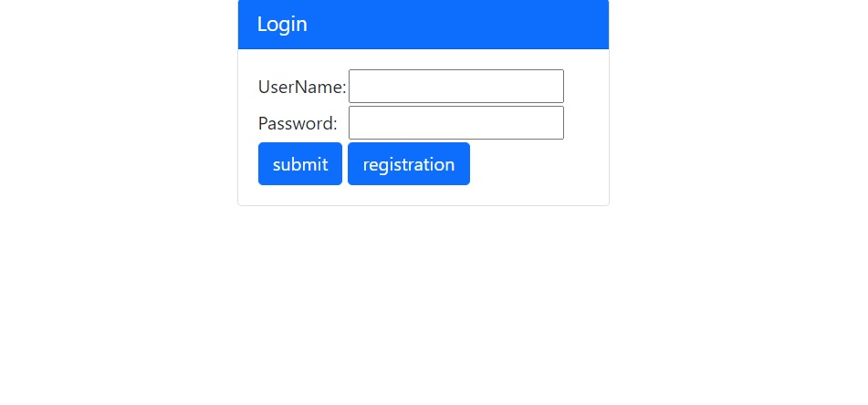
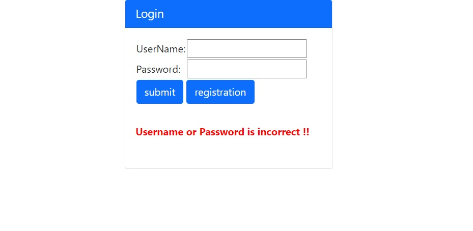
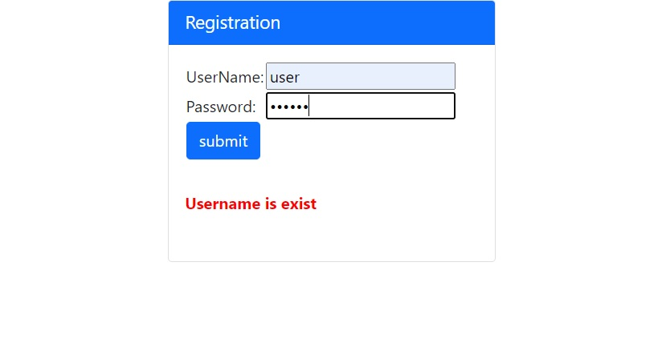
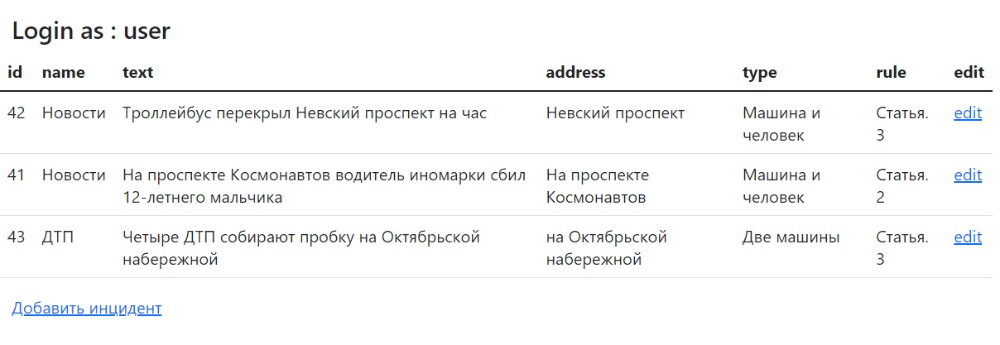

# job4j_car_accident

# Цель проекта
Данный проект создавался для изучения работы Spring и его компонентов. На проекте применена концепция внедрения зависимости (DI), как вручную, так и с применением Spring.
Так же Spring MVC - работа с Model, аннотациями, применение Spring Security, Template, ORM и Test.
# Описание проекта
Проект представляет собой сервис для фиксации авто-нарушений.
После регистрации и входа в систему вы увидите список всех нарушений. 
Добавление и редактирование нового нарушения возможно по соответствующей кнопке, 
на форму выгружаются возможные статьи нарушений и тип.
# Интерфейс
- Авторизация:

- Проверка ввода логина и пароля

- Проверка дублирования пользователя

- Основная страница
